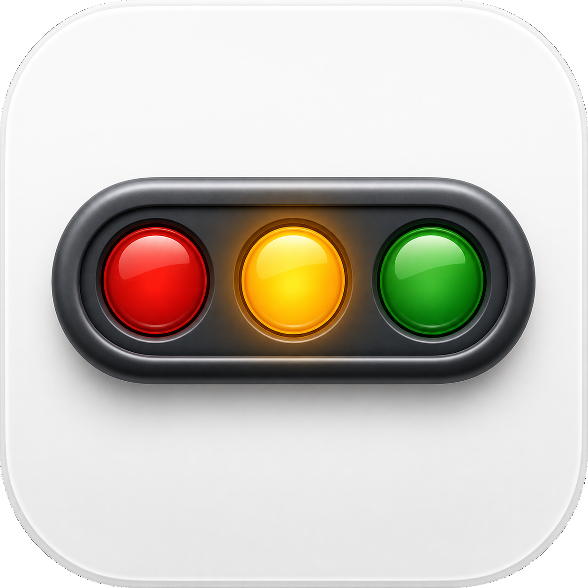
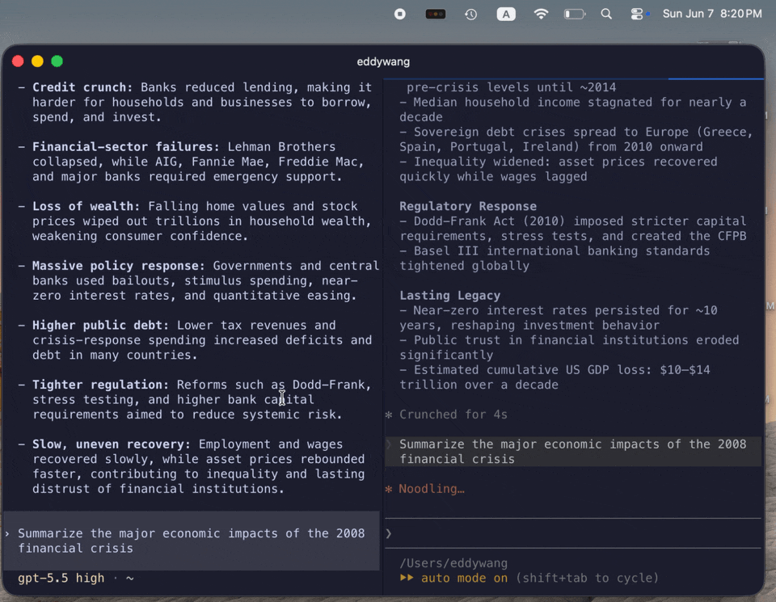

# Agent Light

<p align="center">
  
</p>

<p align="center">
  <a href="https://github.com/eddykwang/agent-light/releases/latest">
    
  </a>
</p>

A tiny macOS menu bar app for keeping an eye on background coding agents.

Agent Light watches local Codex and Claude Code sessions and turns them
into a simple traffic-light signal in your menu bar: working, idle, failed, or
unknown. It is built for the moment when you have several agents running in the
background and you do not want to keep switching windows just to know whether
one of them finished, failed, or is still busy.

## Table of Contents

- [Install](#install)
- [Screenshots](#screenshots)
- [Features](#features)
- [Status Colors](#status-colors)
- [How It Works](#how-it-works)
- [Privacy](#privacy)
- [Requirements](#requirements)
- [Releases](#releases)
- [Run Locally](#run-locally)
- [Development](#development)
- [Configuration](#configuration)
- [Limitations](#limitations)
- [Repository Notes](#repository-notes)
- [License](#license)

## Install

With Homebrew:

```bash
brew tap eddykwang/tap
brew install --cask agent-light
```

Or download the latest zip from
[GitHub Releases](https://github.com/eddykwang/agent-light/releases/latest),
unzip it, and move `Agent Light.app` to `/Applications`.

Current release builds are unsigned and not notarized, so macOS may show an
unidentified developer warning the first time you open the app.

## Screenshots

<p align="center">
  
</p>

## Features

- Native macOS menu bar indicator with vertical or horizontal traffic-light
  layouts.
- Automatic Codex detection through local rollout files.
- Automatic Claude Code detection through local transcript files.
- Optional Claude Code hooks mode for more precise permission, input, and
  completion status.
- Read-only liveness checks using file handles, modification times, and local
  process metadata.
- Optional macOS notifications for attention states, individual session
  completions, and all-agents-idle transitions.
- Launch-at-login support.
- No hooks required for the default Codex or Claude Code support path.

## Status Colors

| Color | Meaning |
| --- | --- |
| Green | At least one agent is working normally. |
| Yellow | An agent needs permission or input. |
| Red | An agent failed or hit an error. |
| Dim/off | Agents are idle or complete. |
| Gray | No current status could be determined. |

When multiple sessions are visible, the aggregate menu bar status still prefers
failure, then input, then working, then idle.

## How It Works

Agent Light is split into two local processes:

1. `Agent Light.app` is the menu bar app bundle. Its `AgentTrafficLights`
   executable reads a shared status file and renders the icon, popover,
   settings, and notifications.
2. `AgentStatusCollector` is started by the app. It scans local agent artifacts,
   classifies sessions, filters stale ones, and writes:

```text
~/.agent-traffic-lights/status.json
```

For Codex, the collector scans:

```text
~/.codex/sessions/**/rollout-*.jsonl
```

For Claude Code, the collector scans:

```text
~/.claude/projects/**/*.jsonl
```

Codex usually keeps live rollout files open, so the collector can use `lsof` as
an accurate liveness signal. Claude Code closes transcript files between writes,
so the collector combines recent transcript updates with read-only local process
checks scoped to the same workspace.

Claude Code can also be switched to optional hooks mode during onboarding or
from **Settings... > Claude Code**. In that mode Agent Light adds local Claude
Code command hooks that call the bundled `AgentClaudeHook` helper. The helper
receives Claude Code lifecycle events and writes compact status metadata under:

```text
~/.agent-traffic-lights/claude-hooks
```

Hooks improve `needsInput` and completion detection for Claude Code. They do not
send prompts, tool inputs, model responses, or transcript content to Agent Light.
New hook settings apply to new Claude Code sessions; restart existing Claude
Code sessions after installing or removing hooks.

## Privacy

Everything runs locally on your Mac.

- The app does not call Codex, Claude Code, or any model API.
- The app does not send telemetry.
- The app does not modify agent transcripts or rollout files.
- The app does not add anything to an agent's context window.
- Default support does not require installing Codex or Claude Code hooks.
- Optional Claude Code hooks store status metadata only, locally on your Mac.

The collector reads local agent metadata and writes a compact local status JSON
file for the menu bar app to display.

## Requirements

- macOS 14 or newer
- Swift 5.10
- Xcode Command Line Tools

## Releases

Download the latest build from the
[latest release](https://github.com/eddykwang/agent-light/releases/latest).

GitHub release builds are currently unsigned and not notarized. The release zip
uses an ad-hoc signature only to keep the app bundle internally valid.

Because the app is not Developer ID signed, macOS may show an unidentified
developer warning the first time you open it. This is expected for the current
early release builds.

Create a local release zip:

```bash
./script/package_release.sh v0.1.3
```

Tagging a version also publishes the unsigned zip through GitHub Actions:

```bash
git tag v0.1.3
git push origin v0.1.3
```

## Run Locally

Build and launch a local app bundle:

```bash
./script/build_and_run.sh run
```

The script creates:

```text
dist/Agent Light.app
```

You can move that app bundle to `/Applications` if you want launch-at-login to
behave like a normal installed macOS app.

## Development

Run the test suite:

```bash
swift test
```

Build without launching:

```bash
swift build
```

Verify that the app bundle launches:

```bash
./script/build_and_run.sh verify
```

## Configuration

Open **Settings...** from the menu bar popover to change:

- traffic-light orientation
- Claude Code default or hooks-based status detection
- shared status file path
- attention notifications
- individual session completion notifications
- all-agents-idle completion notifications
- launch at login

The menu bar popover also shows the current Claude Code mode. Click
`CC mode: ...` to jump straight to the Claude Code settings tab.

The default status file path is:

```text
~/.agent-traffic-lights/status.json
```

## Limitations

- Codex approval prompts are not reliably represented in rollout JSONL, so they
  cannot always be inferred as `needsInput` from rollout files alone.
- Claude Code transcript-only mode is best-effort for permission prompts. Use
  the recommended Claude Code hooks mode from onboarding or
  **Settings... > Claude Code** for more precise `needsInput` and completion
  status.
- New Claude Code hook settings apply to new Claude Code sessions. Start a new
  Claude Code session after installing, removing, or changing hooks.
- If you move the app bundle after installing Claude Code hooks, install hooks
  again so Claude Code points at the new app path.
- The app currently targets macOS only.

## Repository Notes

Local agent state is intentionally ignored by Git. Files such as `.codex/`,
`.claude/`, `.agents/`, `.superpowers/`, and `CLAUDE.md` are treated as local
workspace state rather than project source.

## License

MIT
